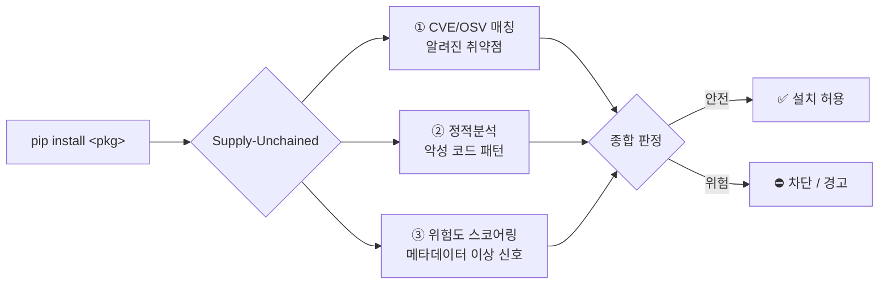
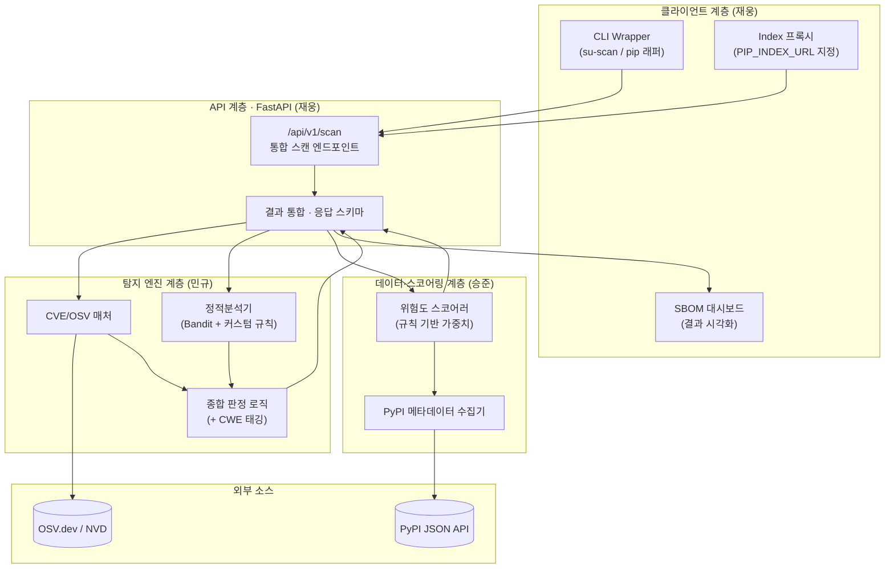
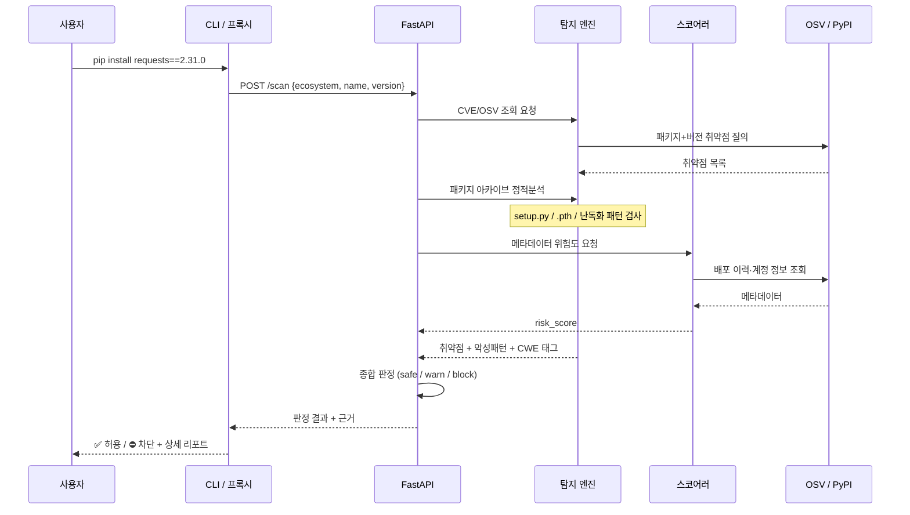
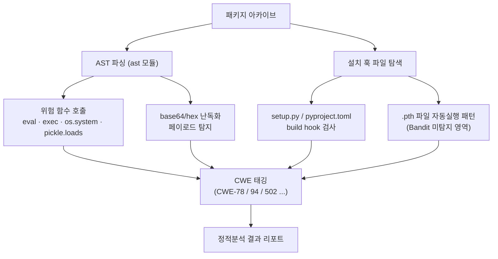
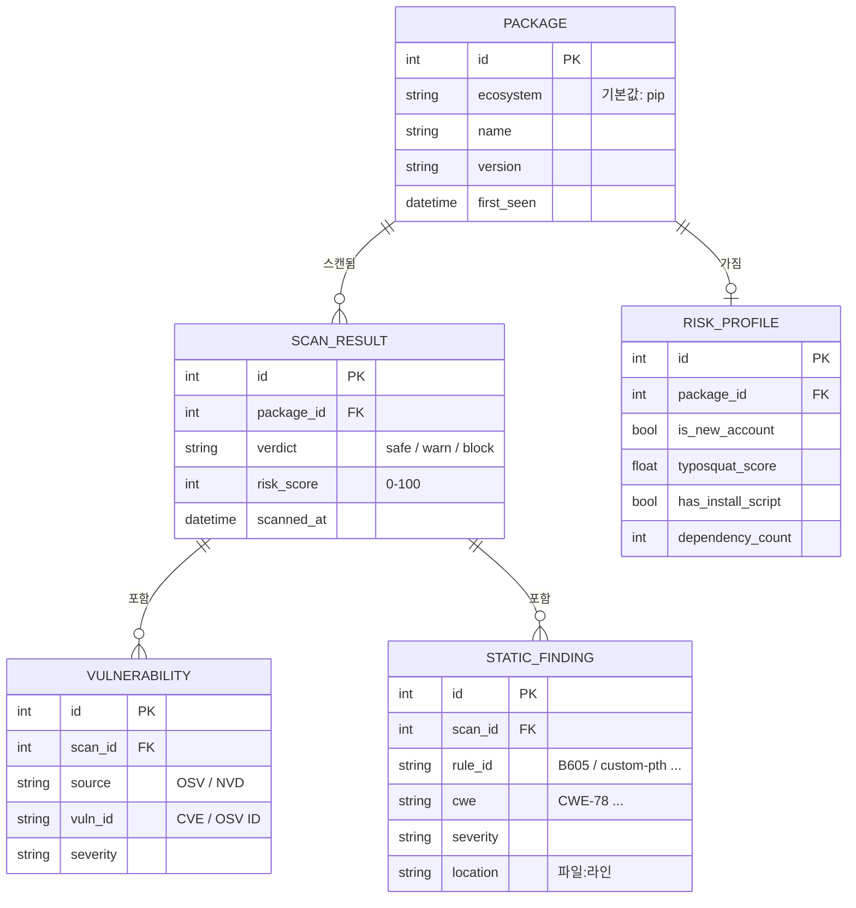
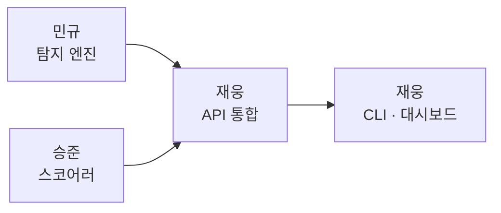
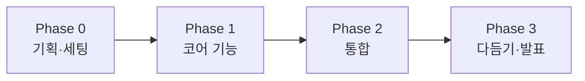

<div align="center">

# ⛓️‍💥 Supply-Unchained

**pip 공급망을 노리는 위협을, 설치되기 전에 끊어낸다**

pip 패키지 설치 시점에 CVE/OSV 취약점 탐지 · 정적분석 · 위험도 스코어링을 결합해
알려진 취약점은 물론, 아직 CVE도 없는 신종 악성 패키지까지 사전에 탐지·차단하는
오픈소스 공급망 보안 시스템

`Static Analysis` · `CVE/OSV` · `Risk Scoring` · `FastAPI` · `Python`

> ⚠️ **현재 문서는 기획 단계 설계안입니다.** 세부 스키마·엔드포인트·규칙셋은 개발 진행에 따라 변경될 수 있습니다.

</div>

---

## 📑 목차

1. [배경 & 문제의식](#-배경--문제의식)
2. [핵심 아이디어](#-핵심-아이디어)
3. [경쟁 도구 대비 포지셔닝](#-경쟁-도구-대비-포지셔닝)
4. [시스템 아키텍처](#-시스템-아키텍처)
5. [탐지 파이프라인](#-탐지-파이프라인)
6. [데이터 설계](#-데이터-설계)
7. [API 설계 (초안)](#-api-설계-초안)
8. [기술 스택](#-기술-스택)
9. [팀 & 역할 분담](#-팀--역할-분담)
10. [개발 로드맵](#-개발-로드맵)
11. [초기 세팅 가이드](#-초기-세팅-가이드)
12. [Future Work](#-future-work)

---

## 🎯 배경 & 문제의식

생성형 AI 코딩 도구가 개발 현장의 표준이 되면서 개발 속도는 빨라졌지만,
**검증되지 않은 외부 패키지가 그대로 코드에 섞여 들어가는 위험**도 함께 커지고 있습니다.

| 지표 | 수치 | 출처 |
|---|---|---|
| 2025년 신규 식별 악성 오픈소스 패키지 | **45만 개 이상** | Sonatype 2026 |
| 전년 대비 악성 패키지 탐지 증가율 | **+73%** | ReversingLabs 2026 |
| 데이터 침해 중 SW 취약점 악용으로 시작된 비율 | **31%** | Verizon DBIR 2026 |

특히 **보안 전담 인력과 자동화 도구가 없는 중소기업·1인 개발자·학생 개발자**는
이러한 공급망 위협에 구조적으로 취약합니다.
`pip install` 한 줄에 바로 붙는 가볍고 무료인 방어 수단이 필요합니다.

---

## 💡 핵심 아이디어

> **"설치되기 전에(pre-install), 여러 층위로(multi-layer) 검사한다"**

기존 도구 대부분은 *이미 설치된 뒤* CVE를 스캔하는 **사후 대응**에 머뭅니다.
Supply-Unchained는 설치 시점에 개입해 **사전 차단**을 지향하며, 세 개의 탐지 레이어를 결합합니다.



| 레이어 | 무엇을 잡나 | 한계 |
|---|---|---|
| ① CVE/OSV 매칭 | 이미 **알려진** 취약점 (확정적) | 신종·미등록 위협은 못 잡음 |
| ② 정적분석 | install hook·난독화·위험 함수 등 **악성 패턴** (휴리스틱) | 고난도 난독화·지연 실행은 놓칠 수 있음 |
| ③ 위험도 스코어링 | 신규 계정·typosquat 등 **메타데이터 이상 신호** | 확률적 판단 (참고 지표) |

> 세 레이어를 합쳐 **"알려진 것은 확실히, 안 알려진 것은 확률적으로"** 걸러내는 것이 목표입니다.

---

## 🥊 경쟁 도구 대비 포지셔닝

| | pip-audit / safety | Socket | **Supply-Unchained** |
|---|:---:|:---:|:---:|
| CVE 매칭 | ✅ | ✅ | ✅ |
| 제로데이·휴리스틱 탐지 | ❌ | ✅ | ✅ |
| 설치 시점 사전 차단 | ❌ (사후 스캔) | ✅ | ✅ |
| 메타데이터 위험도 스코어링 | ❌ | ✅ | ✅ |
| 오픈소스 · 무료 | ✅ | ❌ (상용) | ✅ |
| 주 타깃 | 전체 개발자 | 엔터프라이즈 팀 | 개인·학생·중소기업 |

> **한 줄 포지셔닝:** *Socket 수준의 사전 차단을, 오픈소스로 · 가볍게 · 개인 개발자도 바로.*

---

## 🏗 시스템 아키텍처



**설계 원칙**
- 탐지 엔진 / 데이터 스코어링 / API·클라이언트를 **느슨하게 결합** → 세 파트 병렬 개발 가능
- 모든 탐지 결과는 **API 응답 하나로 통합** → 클라이언트는 진입점만 다르고 동일 API 재사용
- `ecosystem` 파라미터를 스키마에 미리 둬서 **향후 npm 등 확장 대비**

---

## 🔬 탐지 파이프라인



### 정적분석 세부 (민규)



> **차별점:** `pip-audit`류가 못 잡는 **설치 훅(`.pth`, build hook) 악용**을 커스텀 규칙으로 커버합니다.
> (실제 공급망 공격에서 가장 많이 악용되는 경로)

---

## 🗄 데이터 설계

> 초기 MVP는 **경량 관계형 DB(SQLite)** 로 시작 → 필요 시 PostgreSQL 전환.
> 스코어링은 **규칙 기반 가중치**로 시작하므로 대량 학습 데이터는 불필요합니다.



### 위험도 스코어링 규칙 (초안 · 승준)

| 위험 신호 | 판단 근거 | 가중치(예시) |
|---|---|:---:|
| 관리자 계정 신규 생성 | 배포 직전 만들어진 계정 | +25 |
| typosquat 유사도 높음 | 인기 패키지와 이름 유사 | +30 |
| install script 포함 | setup.py 등에 실행 코드 | +20 |
| 비정상 배포 패턴 | 짧은 간격 대량 배포 등 | +15 |
| 다운로드 수 대비 신생 | 신규인데 급증 | +10 |

> 가중치 합산 → 0~100 정규화. **실제 값은 검증용 샘플로 튜닝 예정** (학습 아님).

---

## 🔌 API 설계 (초안)

> 기획 단계 초안입니다. 필드·경로는 개발하며 확정합니다.

**`POST /api/v1/scan`**

```jsonc
// Request
{
  "ecosystem": "pip",        // 확장 대비 필드 (현재 pip만)
  "name": "requests",
  "version": "2.31.0"
}
```

```jsonc
// Response
{
  "verdict": "warn",         // safe | warn | block
  "risk_score": 62,
  "vulnerabilities": [
    { "source": "OSV", "id": "GHSA-xxxx", "severity": "high" }
  ],
  "static_findings": [
    { "rule": "custom-pth", "cwe": "CWE-94", "severity": "high", "location": "install.pth:1" }
  ],
  "risk_signals": {
    "is_new_account": true,
    "typosquat_score": 0.82,
    "has_install_script": true
  }
}
```

---

## 🧰 기술 스택

| 영역 | 기술 |
|---|---|
| 언어 | Python 3.11+ |
| API | FastAPI + Pydantic |
| 정적분석 | `ast` (표준 라이브러리) · Bandit · (검토) Semgrep |
| 취약점 소스 | OSV.dev API · NVD (CVE) |
| 메타데이터 | PyPI JSON API |
| DB | SQLite (MVP) → PostgreSQL (확장 시) |
| HTTP 클라이언트 | httpx (async) |
| CLI | Typer / Click |
| 컨테이너 | Docker · docker-compose |

---

## 👥 팀 & 역할 분담

| 파트 | 담당 | 주요 작업 |
|---|---|---|
| 🛡 보안 코어 엔진 | **민규** | CVE/OSV 매칭, 정적분석기(Bandit+커스텀 규칙), 종합 판정, CWE 매핑 |
| 📊 데이터·스코어링 | **승준** | PyPI 메타데이터 수집, 위험 신호 정의, 규칙 기반 위험도 스코어러 |
| 🔧 API·클라이언트 | **재웅** | FastAPI 통합, CLI/프록시, SBOM 대시보드, Docker·배포 |



---

## 🗺 개발 로드맵



### Phase 0 — 기획 & 초기 세팅 ✅ 진행 중
- [x] 프로젝트 방향·스코프 확정
- [x] 레포 생성 · 팀원 초대
- [ ] 레포 구조 스캐폴딩 (아래 구조)
- [ ] 개발환경 통일 (Python 버전, 의존성 관리, pre-commit)
- [ ] API 응답 스키마 1차 합의

### Phase 1 — 코어 기능 (병렬)
- [ ] **민규**: OSV/NVD 연동 + 정적분석기(Bandit 연동 → 커스텀 규칙)
- [ ] **승준**: PyPI 메타데이터 수집 + 규칙 기반 스코어러
- [ ] **재웅**: FastAPI 뼈대 + `/scan` 엔드포인트 + pip 프록시 PoC

### Phase 2 — 통합
- [ ] 세 모듈을 `/scan` 응답 하나로 통합
- [ ] CLI ↔ API ↔ 엔진 end-to-end 동작
- [ ] SBOM 대시보드 연동
- [ ] 테스트 샘플(악성 패턴 4종)로 탐지 검증

### Phase 3 — 다듬기 & 발표
- [ ] 실제 PyPI 패키지 대상 스캔 데모
- [ ] (도전) 실제 의심 패키지 발견 시 PyPI 신고
- [ ] 발표자료 · 데모 시나리오
- [ ] README·문서 정리, 라이선스 확정

---

## ⚙️ 초기 세팅 가이드

> 아직 코드 스캐폴딩 전입니다. 아래는 **합의용 제안 구조**입니다.

### 제안 레포 구조

```
Supply-Unchained/
├── README.md
├── LICENSE                 # MIT (오픈소스 공모전 취지)
├── pyproject.toml          # 의존성·빌드 설정
├── .gitignore              # .env, __pycache__ 등
├── .env.example            # 키/URL 템플릿 (실제 .env는 커밋 금지)
├── docker-compose.yml
│
├── api/                    # 재웅 — FastAPI
│   ├── main.py
│   ├── routers/scan.py
│   └── schemas.py          # Pydantic 응답 스키마
│
├── engine/                 # 민규 — 탐지 엔진
│   ├── cve_matcher.py      # OSV/NVD 연동
│   ├── static_analyzer.py  # AST + Bandit + 커스텀 규칙
│   ├── rules/              # .pth / install-hook 커스텀 규칙
│   └── verdict.py          # 종합 판정 + CWE 태깅
│
├── scoring/                # 승준 — 데이터·스코어링
│   ├── collector.py        # PyPI 메타데이터 수집
│   ├── features.py         # 위험 신호 추출
│   └── scorer.py           # 규칙 기반 가중치 스코어링
│
├── cli/                    # 재웅 — CLI / 프록시
│   └── su_scan.py
│
├── dashboard/              # 재웅 — SBOM 시각화 (프론트)
│
├── samples/                # 테스트용 악성 패턴 샘플
│   ├── sample1_setup.py    # os.system
│   ├── sample2_exec.py     # base64 + exec
│   ├── sample3_install.pth # .pth 자동실행
│   └── sample4_pickle.py   # 역직렬화
│
├── tests/
└── docs/
    └── architecture.md
```

### 개발 환경 준비 (예정)

```bash
# 1. 클론
git clone https://github.com/<org>/Supply-Unchained.git
cd Supply-Unchained

# 2. 가상환경
python -m venv .venv
source .venv/bin/activate        # Windows: .venv\Scripts\activate

# 3. 의존성 (pyproject 확정 후)
pip install -e ".[dev]"

# 4. 환경변수
cp .env.example .env             # OSV/NVD 등 설정 채우기

# 5. 로컬 실행
uvicorn api.main:app --reload
```

### 그라운드 룰 (제안)
- 브랜치: `main`(보호) ← `feat/<파트>-<기능>` PR
- 커밋: 각자 파트 디렉토리 위주로 작업 → 충돌 최소화
- `.env`·실제 키·데이터 덤프는 **절대 커밋 금지** (`.gitignore` 등록)

---

## 🔭 Future Work

- **동적분석(샌드박스)**: 정적분석에서 걸러진 의심 패키지만 격리 컨테이너에서 실제 실행 → 네트워크·파일시스템 행위 관찰 (MVP 스코프 제외)
- **멀티 에코시스템 확장**: `ecosystem` 파라미터 기반으로 npm · cargo · maven 등 지원
- **머신러닝 스코어링**: 라벨 데이터 확보 시 규칙 기반 → 분류 모델 고도화
- **CI/CD 통합**: GitHub Actions 등에서 PR마다 자동 스캔
- **IDE 플러그인**: 설치 전 에디터 단에서 경고

---

<div align="center">

**나인간전민규일한번저질러보리라** · 오픈소스 활용 공모전 (학생 · 보안/인증)

*⛓️‍💥 Break the chain before it breaks you.*

</div>
