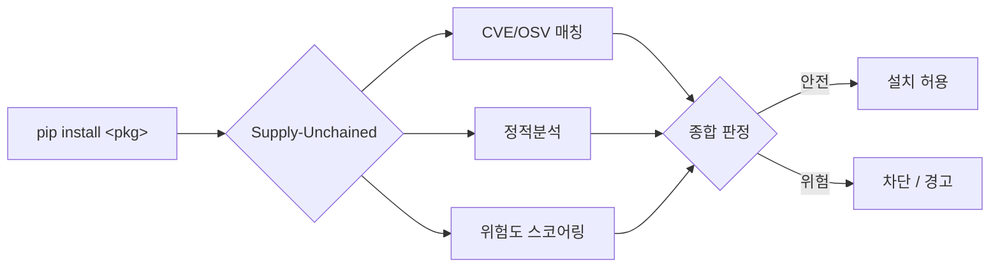

<div align="center">

# Supply-Unchained

pip 패키지 설치 시점에 CVE/OSV 취약점 탐지 · 정적분석 · 위험도 스코어링을 결합해,
알려진 취약점은 물론 아직 CVE가 없는 신종 악성 패키지까지 사전에 걸러내는
오픈소스 공급망 보안 시스템.


</div>

---

## 현재 상태

세 탐지 레이어(CVE/OSV 매칭 · 정적분석 · 위험도 스코어링)가 실제로 동작합니다.
`requests==2.30.0` 을 스캔하면 실제 OSV 취약점을 조회해 오고, 악성 샘플의 `.pth`
자동실행 · 설치 훅 · 난독화 페이로드를 차단합니다.

| 구성 요소 | 상태 |
|---|---|
| CVE/OSV 매칭 (`engine/cve_matcher.py`) | 동작 |
| 정적분석 — 커스텀 규칙 4종 + Bandit (`engine/`, `api/routers/scan.py`) | 동작 |
| 위험도 스코어링 (`scoring/`) | 동작 |
| 통합 스캔 API (`POST /api/v1/scan`) | 동작 |
| CLI (`cli/su_scan.py`) · pip 프록시 (`api/routers/proxy.py`) | 동작 |
| 스캔 이력 저장 (SQLite, `api/storage.py`) | 동작 |
| SBOM 대시보드 (`dashboard/index.html`) | 초기 버전 |
| Docker · CI 2종 (테스트 + 공급망 스캔 게이트) | 동작 |

임계값·규칙셋은 검증 샘플로 계속 튜닝 중입니다. 남은 작업은 대시보드 완성,
실배포(TestPyPI/Docker Hub), 발표 준비입니다.

통합 리뷰와 중간점검 결정 사항은 [`docs/week1-review.md`](docs/week1-review.md),
[`docs/week2-integration.md`](docs/week2-integration.md) 참고.

---

## 배경

생성형 AI 코딩 도구가 표준이 되면서 개발 속도는 빨라졌지만, 검증되지 않은 외부
패키지가 그대로 코드에 섞여 들어가는 위험도 함께 커졌습니다. PyPI는 누구나 패키지를
올릴 수 있고, 설치 시점에 `setup.py`나 `.pth` 파일로 임의 코드를 실행시킬 수 있습니다.
공개 데이터셋([OSSF malicious-packages](https://github.com/ossf/malicious-packages))에
등록된 악성 PyPI 패키지만 1만 건이 넘고, 인기 패키지 이름을 흉내 낸 typosquat과
사내 패키지명을 노린 dependency confusion이 대표적인 공격 경로입니다.

보안 전담 인력이나 자동화 도구가 없는 중소기업 · 1인 개발자 · 학생 개발자는 이런
위협에 특히 취약합니다. `pip install` 한 줄에 바로 붙는 가볍고 무료인 방어 수단이
필요합니다.

---

## 핵심 아이디어

기존 도구 대부분은 이미 설치된 뒤 CVE를 스캔하는 사후 대응입니다.
Supply-Unchained는 설치 시점에 개입해 사전 차단을 지향하며, 세 개의 탐지 레이어를
결합합니다.



| 레이어 | 무엇을 잡나 | 한계 |
|---|---|---|
| CVE/OSV 매칭 | 이미 알려진 취약점 (확정적) | 신종·미등록 위협은 못 잡음 |
| 정적분석 | 설치 훅·난독화·위험 함수 등 악성 패턴 (휴리스틱) | 고난도 난독화·지연 실행은 놓칠 수 있음 |
| 위험도 스코어링 | 신규 계정·typosquat 등 메타데이터 이상 신호 | 확률적 판단 (참고 지표) |

알려진 것은 확실히, 안 알려진 것은 확률적으로 걸러내는 것이 목표입니다.

---

## 시스템 아키텍처

세 계층으로 나뉩니다.

- **클라이언트** — CLI(`su-scan`), pip 인덱스 프록시, SBOM 대시보드. 진입점만 다르고
  모두 같은 스캔 API를 호출합니다.
- **API (FastAPI)** — `POST /api/v1/scan` 하나로 세 레이어 결과를 통합해 응답합니다.
  스캔 이력은 SQLite에 저장합니다.
- **탐지 엔진 · 스코어러** — CVE/OSV 매처, 정적분석기(커스텀 규칙 + Bandit),
  위험도 스코어러. OSV.dev와 PyPI JSON API를 외부 소스로 씁니다.

세 파트를 느슨하게 결합해 병렬 개발이 가능하고, 모든 결과가 API 응답 하나로 모여
클라이언트는 진입점만 다르게 재사용합니다. 스키마의 `ecosystem` 파라미터로 향후
npm 등 확장을 대비했습니다.

한 번의 스캔 요청은 PyPI 조회 1회 · 아카이브 다운로드 1회만 수행합니다. 라우터가
`common.pypi.PackageContext` 를 만들어 정적분석·스코어링 레이어에 함께 넘기기
때문입니다(레이어마다 따로 받으면 같은 sdist를 두 번 내려받습니다).

---

## 탐지 파이프라인

1. CLI/프록시가 `POST /scan {ecosystem, name, version}` 을 호출합니다.
2. API가 세 레이어를 병렬 실행합니다.
   - CVE/OSV: 패키지+버전으로 OSV.dev에 취약점을 질의합니다.
   - 정적분석: 아카이브를 받아 `setup.py` · `.pth` · 난독화 패턴을 검사하고 CWE를
     태깅합니다.
   - 스코어링: 배포 이력·계정 정보 등 메타데이터로 위험도 점수를 냅니다.
3. 세 결과를 종합해 `safe` / `warn` / `block` 을 판정하고, 근거 문장과 함께 응답합니다.

한 레이어가 외부 API 장애로 실패해도 스캔 전체를 죽이지 않고, 남은 레이어로 판정하되
실패 사실을 `layer_errors` 로 응답에 명시합니다. 보안 도구가 장애를 숨기고 "safe"를
주는 것이 최악의 동작이기 때문입니다.

`pip-audit` 류가 못 잡는 설치 훅(`.pth`, build hook) 악용을 커스텀 규칙으로 커버하는
것이 차별점입니다. 실제 공급망 공격에서 가장 많이 악용되는 경로입니다.

---

## API 설계

`api/schemas.py` 가 세 파트가 공유하는 계약(contract)의 소스 오브 트루스입니다.
스키마 변경은 팀 합의 후 진행합니다.

### 엔드포인트

| Method | Path | 설명 |
|---|---|---|
| `POST` | `/api/v1/scan` | 패키지 통합 스캔 (3개 레이어 결과 통합) |
| `GET` | `/health` | 헬스체크 |
| `GET` | `/docs` | Swagger UI — 스키마 확인·테스트용 |

### 요청

```jsonc
{
  "ecosystem": "pip",      // Enum: pip (npm/cargo는 Future Work)
  "name": "requests",      // 1~214자
  "version": "2.31.0"      // 정확한 버전 문자열
}
```

**입력값 화이트리스트 검증** — `name` 은 PEP 503 정규화 규칙(영숫자로 시작·끝,
중간에 `. _ -` 만), `version` 은 PEP 440 문자셋(영숫자 토큰을 `. _ + ! -` 로 연결)만
허용합니다. 셸 메타문자 · 공백 · 옵션 형태(`-`로 시작) 입력은 파이프라인에 들어가기
전에 422로 거부됩니다. 패키지명/버전은 이후 PyPI URL 조립, `pip install` subprocess
인자, 프록시 파일명 파싱 등 여러 싱크로 흐르므로, 입구에서 잘라내는 것이
defense-in-depth 의 기본이라는 판단입니다(Command Injection 원천 차단).

### 응답

```jsonc
{
  "scan_id": 1,
  "ecosystem": "pip",
  "name": "reqeusts",
  "version": "1.0.0",
  "scanned_at": "2026-07-22T13:00:00Z",

  "verdict": "block",              // Enum: safe | warn | block
  "risk_score": 90,                // 0~100
  "verdict_reasons": [
    "정적분석에서 고위험 악성 패턴 탐지",
    "메타데이터 위험도 스코어 90점 (임계 70 이상)"
  ],

  "vulnerabilities": [
    {
      "source": "OSV",             // Enum: OSV | NVD
      "id": "GHSA-9wx4-h78v-vm56",
      "severity": "medium",        // Enum: low | medium | high | critical
      "summary": "취약점 한 줄 요약",
      "fixed_version": "2.31.1"
    }
  ],

  "static_findings": [
    {
      "rule": "custom-pth",
      "cwe": "CWE-94",
      "severity": "high",
      "location": "install.pth:1",
      "detail": "탐지된 패턴 설명"
    }
  ],

  "risk_signals": {
    "is_new_account": true,
    "typosquat_score": 0.82,       // 0.0~1.0 이름 유사도
    "has_install_script": true,
    "dependency_count": 0,
    "release_burst": true
  },

  "layer_errors": []               // 실패한 레이어가 있으면 사유를 명시
}
```

### 판정 규칙 (초안 · 팀 합의 대상)

| 조건 | verdict |
|---|---|
| 정적분석 `high`/`critical` 탐지 또는 `risk_score >= 70` | `block` |
| 알려진 취약점 존재 또는 `risk_score >= 40` | `warn` |
| 그 외 | `safe` |

임계값(70 / 40)은 검증용 샘플로 튜닝 중입니다.

**`high` 를 아무 데나 쓰지 않는 이유:** 처음엔 `eval` · `exec` · `os.system` 을 전부
high로 잡았다가, 실제 `requests` sdist를 스캔했더니 `block` 이 나왔습니다. 걸린 코드는
`if sys.argv[-1] == "publish"` 가드 안의 배포용 셸 명령과, 버전을 읽는
`exec(f.read(), about)` 관용구였습니다 — 둘 다 설치와 무관하거나 거의 모든 패키지가
씁니다. 위험 함수 호출은 그 자체로 판정 근거가 아니라 정황이며, `high` 는 "Python
코드에 흔한 것"이 아니라 "공급망 공격에 특유한 것"(`.pth` 자동실행 · `install` 명령
탈취 · 디코딩→실행 체인)에만 씁니다. 자세한 근거는
[`engine/README.md`](engine/README.md) 참고.

### 에러 처리 정책

| 상황 | 응답 |
|---|---|
| OSV 조회 실패 | 502 — 조회가 실패했으면 "취약점 없음"이라고 말할 수 없음 |
| 패키지가 PyPI에 없음 | 200 + 정적분석 미수행 표시 |
| 아카이브를 못 읽음 | 200 + 정적분석 미수행 표시 |

없는 패키지를 404로 처리하지 않는 이유: 탐지된 악성 패키지는 PyPI에서 삭제되므로
"없음"이야말로 경고할 가치가 있는 상태입니다. 이름 기반 typosquat 점수는 이 경우에도
계속 동작합니다.

**요청 크기 제한 (DoS 방지)** — 스캔 요청 본문은 원래 문자열 몇 개뿐이므로, 10KB 를
넘는 body 는 파싱 이전 단계에서 413으로 차단합니다. 프록시의 대용량 파일 전송은
"응답" 스트리밍이라 이 제한과 무관합니다.

### 오프라인 데모 모드

```bash
SU_OFFLINE_DEMO=1 uv run uvicorn api.main:app
```

네트워크 없이 mock 데이터로 동작합니다(발표장 회선 사고 대비). 이 모드일 때는 응답의
`verdict_reasons` 에 mock임이 명시됩니다.

---

## CI/CD — 자동 테스트와 공급망 게이트

GitHub Actions 워크플로우 2종이 모든 push/PR 에서 자동으로 돕니다.

| 워크플로우 | 하는 일 |
|---|---|
| `ci.yml` | ruff 린트 + pytest 전체 실행 |
| `supply-chain-scan.yml` | 오프라인 데모 모드로 API를 띄우고, 악성 샘플 requirements 는 반드시 차단(exit 1)되고 정상 샘플은 반드시 통과(exit 0)하는지 검증 — "게이트가 살아있는가" 자체를 매 PR마다 증명 |

공급망 게이트의 설계 원칙:

* **미검증 패키지를 절대 `pip install` 하지 않습니다.** 스캔 결과만으로 판단합니다 —
  미검증 패키지를 CI 러너에서 설치·실행하는 것 자체가 공급망 공격 벡터가 되기
  때문이며, "설치되기 전에 끊어낸다"는 프로젝트 원칙을 CI에서도 지킵니다.
* exit 코드를 1(정상 차단) / 0(게이트 사망 → CI 실패) / 2(서버 연결 실패 등 환경
  문제 → CI 실패)로 구분해, 환경 오류를 차단 성공으로 오인하지 않습니다.
* CLI 의 `check-file` 명령이 게이트의 실행 단위입니다. 이 워크플로우를 다른 프로젝트
  레포에 복사하면, 그 팀의 `requirements.txt` 에 악성 패키지를 추가하는 PR 을
  자동으로 막는 실사용 통합 지점이 됩니다 (pip 프록시가 "설치 시점" 개입이라면,
  이쪽은 "PR 시점" 개입).

```bash
# 로컬에서 게이트와 동일한 검사 실행
uv run python -m cli.su_scan check-file requirements.txt   # block 있으면 exit 1
```

---

## 위험도 스코어링 규칙 (초안)

메타데이터에서 위험 신호를 뽑아 규칙 기반 가중치로 합산합니다. 대량 학습 데이터는
필요 없습니다.

| 위험 신호 | 판단 근거 | 가중치(예시) |
|---|---|:---:|
| 관리자 계정 신규 생성 | 배포 직전 만들어진 계정 | +25 |
| typosquat 유사도 높음 | 인기 패키지와 이름 유사 | +30 |
| install script 포함 | setup.py 등에 실행 코드 | +20 |
| 비정상 배포 패턴 | 짧은 간격 대량 배포 등 | +15 |

가중치 합산 후 0~100으로 정규화합니다. 실측 재현율과 튜닝 근거는
[`scoring/README.md`](scoring/README.md) 참고.

---

## 기술 스택

| 영역 | 기술 |
|---|---|
| 언어 | Python 3.12 |
| 패키지·의존성 | uv (`uv.lock` 커밋) |
| API | FastAPI + Pydantic v2 |
| 정적분석 | `ast` (표준 라이브러리) · Bandit + 커스텀 규칙 |
| 취약점 소스 | OSV.dev API (CVE 포함) |
| 메타데이터 | PyPI JSON API |
| DB | SQLite (스캔 이력) |
| HTTP 클라이언트 | httpx (async) |
| 컨테이너 | Docker (`python:3.12-slim`) · docker-compose |

---

## 팀 & 역할 분담

3인 팀. 파트 단위 구분이며, 세부 태스크는 진행하며 조정합니다.

| 파트 | 주요 작업 |
|---|---|
| 보안 코어 엔진 | CVE/OSV 매칭, 정적분석기(Bandit + 커스텀 규칙), 종합 판정, 커스텀 룰 CWE 매핑 |
| 데이터·스코어링 | PyPI 메타데이터 수집, 위험 신호 정의, 규칙 기반 위험도 스코어러 |
| API·클라이언트 | FastAPI 통합, CLI/프록시, SBOM 대시보드, Docker·배포, OSV/Bandit 결과 CWE 태깅, 입력값 검증·요청 크기 제한, CI 보안 게이트 |

---

## 초기 세팅 가이드

### 레포 구조

```
Supply-Unchained/
├── README.md
├── LICENSE                 # MIT
├── pyproject.toml          # 의존성 (uv)
├── uv.lock                 # 커밋 필수 — 전원 동일 환경
├── Dockerfile              # python:3.12-slim
├── docker-compose.yml
│
├── .github/workflows/
│   ├── ci.yml                    # 린트 + 테스트 (모든 push/PR)
│   └── supply-chain-scan.yml     # 공급망 게이트 자동 검증
│
├── api/                    # FastAPI
│   ├── main.py             #   앱 진입점 (/health, /docs)
│   ├── schemas.py          #   세 파트 공통 계약
│   ├── storage.py          #   스캔 이력 (SQLite)
│   ├── cwe.py              #   CWE 태깅
│   └── routers/
│       ├── scan.py         #   POST /api/v1/scan + 종합 판정 + Bandit
│       └── proxy.py        #   pip 인덱스 프록시
│
├── common/pypi.py          # PyPI 조회 · 아카이브 다운로드 · 안전 추출
│
├── engine/                 # 탐지 엔진 (레이어 ①②)
│   ├── cve_matcher.py      #   OSV.dev 연동
│   ├── static_analyzer.py  #   트리 순회 + AST
│   ├── rules/              #   .pth · install hook · 위험 호출 · 난독화
│   └── verdict.py          #   커스텀 룰 CWE 카탈로그
│
├── scoring/                # 데이터·스코어링 (레이어 ③)
│   ├── collector.py        #   메타데이터 정규화
│   ├── features.py         #   위험 신호 추출
│   ├── scorer.py           #   규칙 기반 가중치
│   └── popular_packages.py #   typosquat 비교 대상
│
├── cli/su_scan.py          # CLI (명시 호출 진입점 · pip 래퍼용 guard)
├── tools/                  # 셸 래퍼 (pip install 가로채기)
├── dashboard/index.html    # SBOM 시각화 (초기 버전)
│
├── samples/                # 악성 패턴 샘플 (전부 무해한 픽스처)
│   ├── sample1_install_hook/     # 설치 훅 + 셸 명령
│   ├── sample2_obfuscated/       # base64 → exec
│   ├── sample3_pth_autoexec/     # .pth 자동실행
│   ├── sample4_pickle/           # 역직렬화
│   ├── demo_requirements.txt     # CI 게이트용 — 악성 포함 (차단돼야 통과)
│   └── clean_requirements.txt    # CI 게이트용 — 정상만 (통과돼야 통과)
│
├── tests/                  # pytest (오프라인 기본, `-m live` 로 실 OSV 연동)
└── docs/                   # 리뷰·통합 문서
```

`samples/` 는 디렉토리 1개가 압축 해제된 패키지 1개 구조입니다. 엔진이 실제로 받는
입력 형태와 같아야 규칙이 제대로 검증됩니다.

### 개발 환경 준비

```bash
# uv 설치 (최초 1회)
# macOS / Linux
curl -LsSf https://astral.sh/uv/install.sh | sh
# Windows
powershell -c "irm https://astral.sh/uv/install.ps1 | iex"

# 클론 & 환경 복원
git clone https://github.com/jeonmin0716002-sketch/Supply-Unchained.git
cd Supply-Unchained
uv sync                    # uv.lock 기준 전원 동일 환경

# 로컬 실행
uv run uvicorn api.main:app --reload
# http://localhost:8000/docs 에서 실제 패키지로 테스트

# Docker
docker compose up --build -d
# http://localhost:8000/docs

# 테스트 / 린트
uv run pytest              # 오프라인 (기본)
uv run pytest -m live      # 실제 OSV.dev 연동 테스트 (opt-in)
uv run ruff check .
```

OSV·PyPI 모두 인증이 필요 없어 `.env` 설정 없이 동작합니다.
`SU_OFFLINE_DEMO=1` 만 있으면 네트워크 없이 데모가 됩니다.

### pip install 가로채기 (셸 래퍼)

`pip install` 을 치면 설치 **전에** 스캔이 끼어들게 만드는 셸 래퍼입니다. block 이면
설치를 막고, warn 이면 y/N 로 물어봅니다. `pip list` 처럼 install 이 아닌 명령은
그대로 진짜 pip 으로 넘어갑니다.

**PowerShell** (Windows 기본)

```powershell
cd C:\Supply_unchained
. .\tools\pip-guard.ps1        # 이 세션에만 적용
```

창을 열 때마다 자동으로 걸리게 하려면 프로필에 등록합니다.

```powershell
# 프로필 파일이 없으면 먼저 생성
if (-not (Test-Path $PROFILE)) { New-Item -ItemType File -Force $PROFILE }
notepad $PROFILE
# 아래 한 줄 추가 (경로는 각자 클론 위치로)
. C:\Supply_unchained\tools\pip-guard.ps1
```

해제는 `Remove-Item Function:\pip`, 프로필에서 그 줄을 지우면 영구 해제됩니다.

> `$PROFILE` 경로는 셸마다 다릅니다 — Windows PowerShell 5.1 은
> `문서\WindowsPowerShell\`, PowerShell 7(`pwsh`)은 `문서\PowerShell\` 입니다.
> 등록해도 안 걸리면 **다른 쪽 셸의 프로필에 넣은 것**이니 `$PROFILE` 을 직접 찍어
> 확인하세요. 문서 폴더가 OneDrive 로 리디렉션돼 있으면 경로가 OneDrive 아래로 잡힙니다.

**bash / zsh / Git Bash**

```bash
source tools/pip-guard.sh                                  # 이 세션에만
echo "source $(pwd)/tools/pip-guard.sh" >> ~/.bashrc       # 영구
```

해제는 `unset -f pip`.

동작 예시:

```
$ pip install pyyaml==5.3.1
┌ 설치 전 스캔 — 1개 ─────────────────────────────────────────────┐
│ pyyaml==5.3.1 │ warn │ 20 │ 알려진 취약점 2건 (최고 심각도: critical) │
└─────────────────────────────────────────────────────────────────┘
경고가 있는 패키지: pyyaml==5.3.1 — 설치할까요? [y/N]:
```

알아둘 점:

* **`cmd.exe` 는 지원하지 않습니다.** PowerShell 또는 Git Bash 를 쓰세요.
* 스캐너는 이 저장소의 `.venv` 에서 돌지만, **설치는 지금 서 있는 환경에 들어갑니다.**
  래퍼가 진짜 pip 경로를 찾아 넘기기 때문입니다.
* 로컬 경로·URL·`git+` 설치는 스캔 대상이 아니며, 넘어갈 때 "스캔하지 않음"으로
  화면에 표시됩니다 — 조용히 통과시키지 않습니다.
* `requests>=2.0` 처럼 버전이 못박히지 않은 스펙은 pip 이 무엇을 고를지 알 수 없어
  최신 버전을 스캔하고 `(최신 기준)` 으로 표시합니다.

래퍼 없이 한 번만 쓰려면 CLI 를 직접 불러도 됩니다.

```bash
uv run python -m cli.su_scan install pyyaml==5.3.1   # 스캔 후 설치
uv run python -m cli.su_scan check pyyaml==5.3.1     # 스캔만
```

---

## 라이선스

[MIT](LICENSE)
