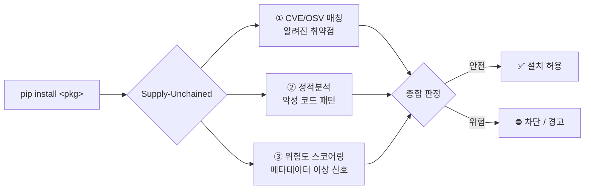
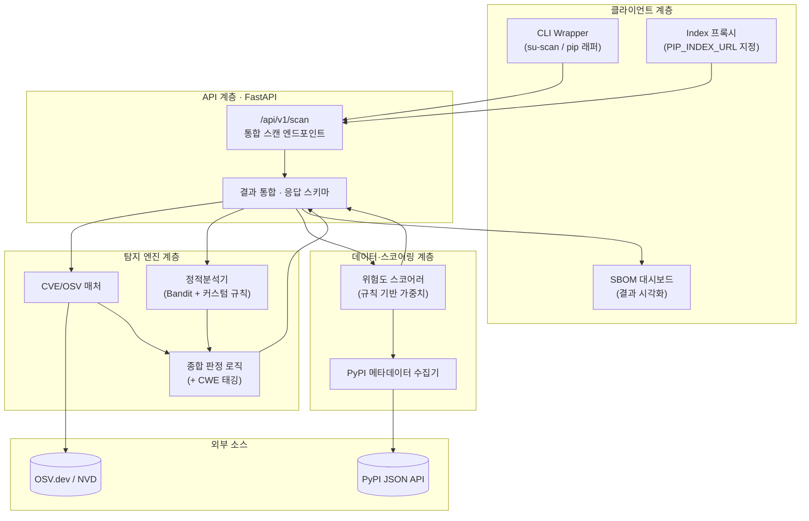
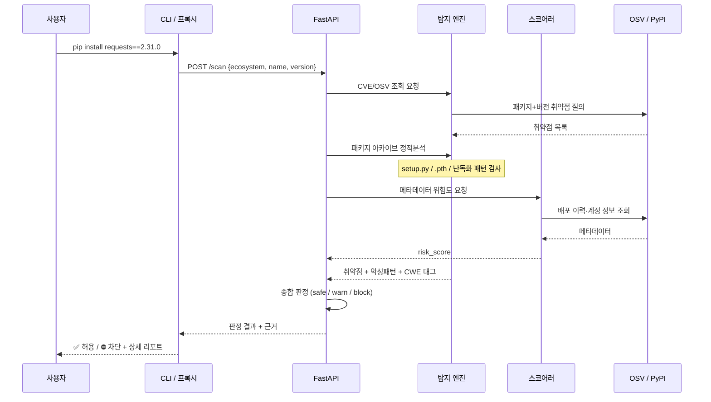
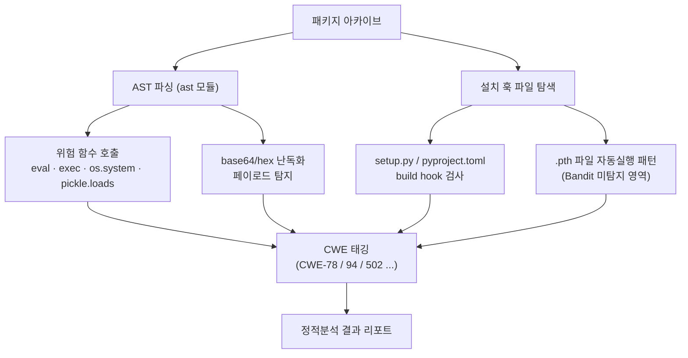
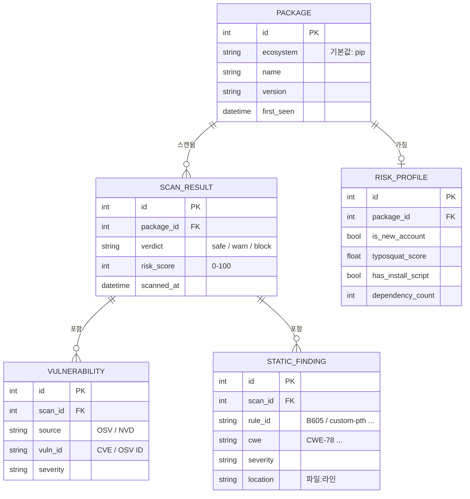
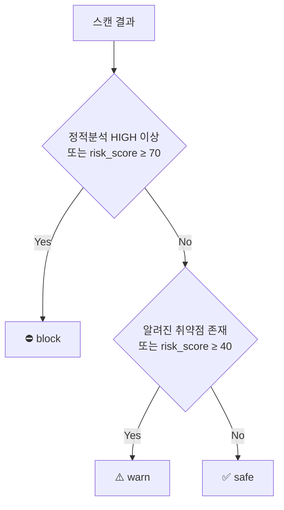
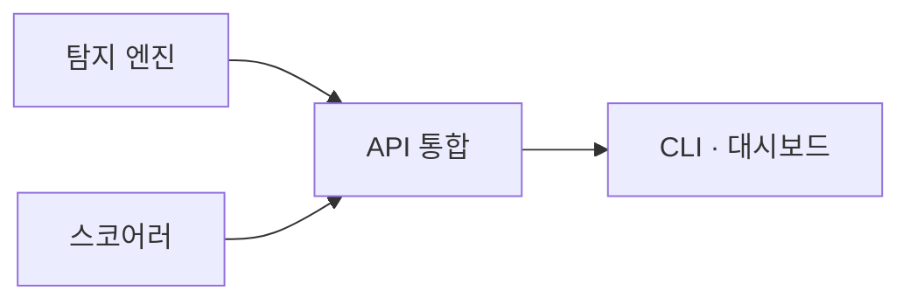
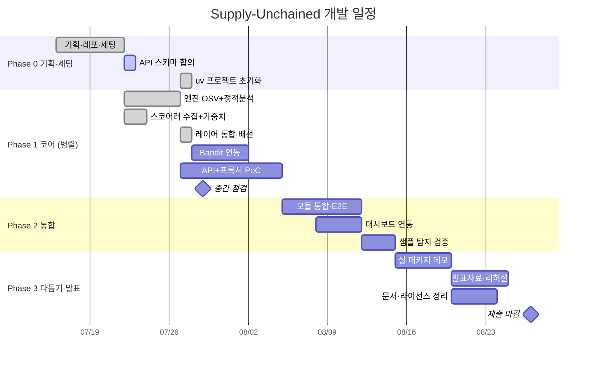

<div align="center">

# ⛓️‍💥 Supply-Unchained

**pip 공급망을 노리는 위협을, 설치되기 전에 끊어낸다**

pip 패키지 설치 시점에 CVE/OSV 취약점 탐지 · 정적분석 · 위험도 스코어링을 결합해
알려진 취약점은 물론, 아직 CVE도 없는 신종 악성 패키지까지 사전에 탐지·차단하는
오픈소스 공급망 보안 시스템

`Static Analysis` · `CVE/OSV` · `Risk Scoring` · `FastAPI` · `Python`

> ⚙️ **Phase 1 진행 중 — 탐지 레이어 3개가 모두 실제로 동작합니다.**
> `pip install requests==2.30.0` 을 스캔하면 실제 OSV 취약점 8건을 찾아내고,
> 악성 샘플의 `.pth` 자동실행·설치 훅·난독화 페이로드를 차단합니다.
> 남은 것은 CLI/프록시·대시보드(재웅)와 Bandit 연동입니다. 임계값·규칙셋은 계속 튜닝 중입니다.

</div>

---

## 📑 목차

1. [배경 & 문제의식](#-배경--문제의식)
2. [핵심 아이디어](#-핵심-아이디어)
3. [경쟁 도구 대비 포지셔닝](#-경쟁-도구-대비-포지셔닝)
4. [시스템 아키텍처](#-시스템-아키텍처)
5. [탐지 파이프라인](#-탐지-파이프라인)
6. [데이터 설계](#-데이터-설계)
7. [API 설계](#-api-설계)
8. [기술 스택](#-기술-스택)
9. [팀 & 역할 분담](#-팀--역할-분담)
10. [개발 로드맵](#-개발-로드맵)
11. [초기 세팅 가이드](#-초기-세팅-가이드)
12. [Future Work](#-future-work)

---

## 🎯 배경 & 문제의식

생성형 AI 코딩 도구가 개발 현장의 표준이 되면서 개발 속도는 빨라졌지만,
**검증되지 않은 외부 패키지가 그대로 코드에 섞여 들어가는 위험**도 함께 커지고 있습니다.

| 지표 | 수치 | 출처 |
|---|---|---|
| 2025년 신규 식별 악성 오픈소스 패키지 | **45만 개 이상** | Sonatype 2026 |
| 전년 대비 악성 패키지 탐지 증가율 | **+73%** | ReversingLabs 2026 |
| 데이터 침해 중 SW 취약점 악용으로 시작된 비율 | **31%** | Verizon DBIR 2026 |

특히 **보안 전담 인력과 자동화 도구가 없는 중소기업·1인 개발자·학생 개발자**는
이러한 공급망 위협에 구조적으로 취약합니다.
`pip install` 한 줄에 바로 붙는 가볍고 무료인 방어 수단이 필요합니다.

---

## 💡 핵심 아이디어

> **"설치되기 전에(pre-install), 여러 층위로(multi-layer) 검사한다"**

기존 도구 대부분은 *이미 설치된 뒤* CVE를 스캔하는 **사후 대응**에 머뭅니다.
Supply-Unchained는 설치 시점에 개입해 **사전 차단**을 지향하며, 세 개의 탐지 레이어를 결합합니다.



| 레이어 | 무엇을 잡나 | 한계 |
|---|---|---|
| ① CVE/OSV 매칭 | 이미 **알려진** 취약점 (확정적) | 신종·미등록 위협은 못 잡음 |
| ② 정적분석 | install hook·난독화·위험 함수 등 **악성 패턴** (휴리스틱) | 고난도 난독화·지연 실행은 놓칠 수 있음 |
| ③ 위험도 스코어링 | 신규 계정·typosquat 등 **메타데이터 이상 신호** | 확률적 판단 (참고 지표) |

> 세 레이어를 합쳐 **"알려진 것은 확실히, 안 알려진 것은 확률적으로"** 걸러내는 것이 목표입니다.

---

## 🥊 경쟁 도구 대비 포지셔닝

| | pip-audit / safety | Socket | **Supply-Unchained** |
|---|:---:|:---:|:---:|
| CVE 매칭 | ✅ | ✅ | ✅ |
| 제로데이·휴리스틱 탐지 | ❌ | ✅ | ✅ |
| 설치 시점 사전 차단 | ❌ (사후 스캔) | ✅ | ✅ |
| 메타데이터 위험도 스코어링 | ❌ | ✅ | ✅ |
| 오픈소스 · 무료 | ✅ | ❌ (상용) | ✅ |
| 주 타깃 | 전체 개발자 | 엔터프라이즈 팀 | 개인·학생·중소기업 |

> **한 줄 포지셔닝:** *Socket 수준의 사전 차단을, 오픈소스로 · 가볍게 · 개인 개발자도 바로.*

---

## 🏗 시스템 아키텍처



**설계 원칙**
- 탐지 엔진 / 데이터 스코어링 / API·클라이언트를 **느슨하게 결합** → 세 파트 병렬 개발 가능
- 모든 탐지 결과는 **API 응답 하나로 통합** → 클라이언트는 진입점만 다르고 동일 API 재사용
- `ecosystem` 파라미터를 스키마에 미리 둬서 **향후 npm 등 확장 대비**

---

## 🔬 탐지 파이프라인



### 정적분석 세부



> **차별점:** `pip-audit`류가 못 잡는 **설치 훅(`.pth`, build hook) 악용**을 커스텀 규칙으로 커버합니다.
> (실제 공급망 공격에서 가장 많이 악용되는 경로)

---

## 🗄 데이터 설계

> 초기 MVP는 **경량 관계형 DB(SQLite)** 로 시작 → 필요 시 PostgreSQL 전환.
> 스코어링은 **규칙 기반 가중치**로 시작하므로 대량 학습 데이터는 불필요합니다.



### 위험도 스코어링 규칙 (초안)

| 위험 신호 | 판단 근거 | 가중치(예시) |
|---|---|:---:|
| 관리자 계정 신규 생성 | 배포 직전 만들어진 계정 | +25 |
| typosquat 유사도 높음 | 인기 패키지와 이름 유사 | +30 |
| install script 포함 | setup.py 등에 실행 코드 | +20 |
| 비정상 배포 패턴 | 짧은 간격 대량 배포 등 | +15 |
| 다운로드 수 대비 신생 | 신규인데 급증 | +10 |

> 가중치 합산 → 0~100 정규화. **실제 값은 검증용 샘플로 튜닝 예정** (학습 아님).

---

## 🔌 API 설계

> **세 파트가 만나는 계약(contract) 지점.** `api/schemas.py`가 소스 오브 트루스이며,
> 스키마 변경은 반드시 팀 합의 후 진행합니다.
> 세 레이어 모두 실제 모듈이 연결되어 있습니다 (mock 아님).

### 엔드포인트

| Method | Path | 설명 |
|---|---|---|
| `POST` | `/api/v1/scan` | 패키지 통합 스캔 (3개 레이어 결과 통합) |
| `GET` | `/health` | 헬스체크 |
| `GET` | `/docs` | Swagger UI — 스키마 확인·테스트용 |

### Request

```jsonc
{
  "ecosystem": "pip",      // Enum: pip (npm/cargo는 Future Work)
  "name": "requests",      // 1~214자
  "version": "2.31.0"      // 정확한 버전 문자열
}
```

### Response

```jsonc
{
  // ── 식별 정보 (DB SCAN_RESULT와 대응, 대시보드 재조회용)
  "scan_id": 1,
  "ecosystem": "pip",
  "name": "reqeusts",
  "version": "1.0.0",
  "scanned_at": "2026-07-22T13:00:00Z",

  // ── 종합 판정
  "verdict": "block",              // Enum: safe | warn | block
  "risk_score": 90,                // 0~100
  "verdict_reasons": [             // CLI가 그대로 출력 가능한 문장 목록
    "정적분석에서 고위험 악성 패턴 탐지",
    "메타데이터 위험도 스코어 90점 (임계 70 이상)"
  ],

  // ── ① CVE/OSV 매칭 레이어 (탐지 엔진)
  "vulnerabilities": [
    {
      "source": "OSV",             // Enum: OSV | NVD
      "id": "GHSA-9wx4-h78v-vm56",
      "severity": "medium",        // Enum: low | medium | high | critical
      "summary": "취약점 한 줄 요약",
      "fixed_version": "2.31.1"    // 업그레이드 안내용
    }
  ],

  // ── ② 정적분석 레이어 (탐지 엔진)
  "static_findings": [
    {
      "rule": "custom-pth",        // Bandit 규칙 ID 또는 커스텀 규칙 ID
      "cwe": "CWE-94",
      "severity": "high",
      "location": "install.pth:1", // 파일:라인
      "detail": "탐지된 패턴 설명"
    }
  ],

  // ── ③ 위험도 스코어링 레이어 (데이터·스코어링)
  "risk_signals": {
    "is_new_account": true,        // 배포 직전 생성된 관리자 계정
    "typosquat_score": 0.82,       // 0.0~1.0 이름 유사도
    "has_install_script": true,    // 설치 시 실행 코드 포함
    "dependency_count": 0,
    "release_burst": true          // 비정상 배포 패턴
  }
}
```

### 판정 규칙 (초안 · 팀 합의 대상)



| 조건 | verdict |
|---|---|
| 정적분석 `high`/`critical` 탐지 **또는** `risk_score ≥ 70` | `block` |
| 알려진 취약점 존재 **또는** `risk_score ≥ 40` | `warn` |
| 그 외 | `safe` |

> 임계값(70 / 40)은 검증용 샘플로 튜닝 예정.

**`high`를 아무 데나 쓰지 않는 이유:** 처음엔 `eval`·`exec`·`os.system`을 전부 high로
잡았다가, 실제 `requests` sdist를 스캔했더니 **`block`이 나왔습니다.** 걸린 코드는
`if sys.argv[-1] == "publish"` 가드 안의 배포용 셸 명령과, 버전을 읽는
`exec(f.read(), about)` 관용구였습니다 — 둘 다 설치와 무관하거나 거의 모든 패키지가 씁니다.

> 위험 함수 호출은 그 자체로 판정 근거가 아니라 **정황**입니다.
> `high`는 "Python 코드에 흔한 것"이 아니라 **"공급망 공격에 특유한 것"**에만 씁니다 —
> `.pth` 자동실행 · `install`/`develop` 명령 탈취 · 디코딩→실행 체인.

자세한 근거는 [`engine/README.md`](engine/README.md#심각도-모델--왜-custom-dangerous-call은-high가-아닌가) 참고.

### 에러 응답

```jsonc
{ "error": "package_not_found", "detail": "..." }
```
404(패키지 없음) / 502(외부 API 실패) 등에 공통 사용.

### 레이어 연결 상태

| 레이어 | 실제 모듈 | 담당 | 상태 |
|---|---|---|:---:|
| ① CVE/OSV | `engine.cve_matcher.match_package` | 민규 | ✅ |
| ② 정적분석 | `engine.static_analyzer.analyze_package` | 민규 | ✅ (Bandit 연동 남음) |
| ③ 위험도 | `scoring.scorer.score_package` | 승준 | ✅ |
| 종합 판정 | `api/routers/scan.py::_decide` | — | ✅ (엔진 이전은 미결) |

**요청당 PyPI 조회 1회 · 아카이브 다운로드 1회.** 라우터가 `common.pypi.PackageContext`를
만들어 ②③에 넘기기 때문입니다. 레이어마다 따로 받으면 같은 sdist를 두 번 내려받습니다.

### 오프라인 데모 모드

```bash
SU_OFFLINE_DEMO=1 uv run uvicorn api.main:app
```

네트워크 없이 mock 데이터로 동작합니다 (발표장 회선 사고 대비).
이 모드일 때는 응답의 `verdict_reasons`에 mock임이 명시됩니다.

### 에러 처리 정책

| 상황 | 응답 |
|---|---|
| OSV 조회 실패 | **502** — 조회가 실패했으면 "취약점 없음"이라고 말할 수 없음 |
| 패키지가 PyPI에 없음 | **200** + 정적분석 미수행 표시 |
| 아카이브를 못 읽음 | **200** + 정적분석 미수행 표시 |

> 없는 패키지를 404로 처리하지 **않는** 이유: 탐지된 악성 패키지는 PyPI에서 삭제되므로,
> "없음"이야말로 경고할 가치가 있는 상태입니다. 이름 기반 typosquat 점수는 계속 동작합니다.
> (README 초안의 `package_not_found` 404와 다른 동작 — 팀 확정 필요)

---

## 🧰 기술 스택

| 영역 | 기술 |
|---|---|
| 언어 | **Python 3.12** (전원 통일) |
| 패키지·의존성 | **uv** (`uv.lock` 커밋 필수) |
| API | FastAPI + Pydantic v2 |
| 정적분석 | `ast` (표준 라이브러리) · **Bandit** (라이브러리 import) + 커스텀 규칙 |
| 취약점 소스 | **OSV.dev API** (CVE 포함) — NVD는 추후 보강 |
| 메타데이터 | PyPI JSON API |
| DB | SQLite (MVP) → PostgreSQL (확장 시) · **스캔 이력 저장용** |
| HTTP 클라이언트 | httpx (async) |
| CLI | Typer / Click |
| 컨테이너 | Docker (`python:3.12-slim`) · docker-compose |

---

## 👥 팀 & 역할 분담

> 3인 팀. 아래는 파트 단위 구분이며, 세부 태스크 배분은 진행하며 조정합니다.

| 파트 | 주요 작업 |
|---|---|
| 🛡 보안 코어 엔진 | CVE/OSV 매칭, 정적분석기(Bandit+커스텀 규칙), 종합 판정, CWE 매핑 |
| 📊 데이터·스코어링 | PyPI 메타데이터 수집, 위험 신호 정의, 규칙 기반 위험도 스코어러 |
| 🔧 API·클라이언트 | FastAPI 통합, CLI/프록시, SBOM 대시보드, Docker·배포 |



---

## 🗺 개발 로드맵



### Phase 0 — 기획 & 초기 세팅 ✅ 완료
- [x] 프로젝트 방향·스코프 확정
- [x] 레포 생성 · 팀원 초대
- [x] 개발환경 통일 (Python 3.12 · uv · Docker slim)
- [x] API 스키마 초안 + mock 데모 구현
- [x] 레포 구조 스캐폴딩 · `.gitignore` 정비
- [x] **uv 프로젝트 실제 초기화** (`pyproject.toml` · `uv.lock` 커밋)
- [ ] **API 스키마 팀 합의 확정** (Week 0 회의 — 체크박스 미기입 상태)

### Phase 1 — 코어 기능 (병렬)
- [x] **탐지 엔진 ①**: OSV.dev 연동 (실동작)
- [x] **탐지 엔진 ②**: 커스텀 규칙 4종 (`.pth` · install hook · 위험 호출 · 난독화)
- [ ] **탐지 엔진 ②**: Bandit 라이브러리 연동 (의존성만 등록됨)
- [x] **데이터·스코어링**: PyPI 메타데이터 수집 + 규칙 기반 스코어러 (실동작)
- [x] **공용**: PyPI fetcher (`common/`) — 다운로드·안전 추출
- [ ] **API·클라이언트**: pip 프록시 PoC · CLI

### Phase 2 — 통합
- [x] 세 모듈을 `/scan` 응답 하나로 통합
- [x] 테스트 샘플(악성 패턴 4종)로 탐지 검증
- [x] 실제 PyPI 패키지 대상 오탐 검증 (`requests` · `flask`)
- [ ] CLI ↔ API ↔ 엔진 end-to-end 동작
- [ ] SBOM 대시보드 연동

> 📌 통합 리뷰 결과와 7/29 중간점검 결정 안건은 [`docs/week1-review.md`](docs/week1-review.md) 참고.

### Phase 3 — 다듬기 & 발표
- [ ] 실제 PyPI 패키지 대상 스캔 데모
- [ ] (도전) 실제 의심 패키지 발견 시 PyPI 신고
- [ ] 발표자료 · 데모 시나리오
- [ ] README·문서 정리, 라이선스 확정

---

## ⚙️ 초기 세팅 가이드

> `api/` · `engine/` · `scoring/` · `common/` 은 구현되어 실행 가능합니다.
> `cli/` · `dashboard/` 는 Phase 1에서 채워집니다. (✅ = 구현됨)

### 레포 구조

```
Supply-Unchained/
├── README.md
├── pyproject.toml          # ✅ 의존성 (uv)
├── uv.lock                 # ✅ 커밋 필수 — 전원 동일 환경
├── .python-version         # ✅ 3.12
├── .gitignore
├── LICENSE                 # MIT (오픈소스 공모전 취지) — 미작성
├── docker-compose.yml      # 미작성
│
├── api/                    # ✅ FastAPI
│   ├── main.py             #    앱 진입점 (/health, /docs)
│   ├── schemas.py          #    ⭐ 세 파트 공통 계약 (변경 시 팀 합의)
│   └── routers/scan.py     #    POST /api/v1/scan + 종합 판정 + 오프라인 모드
│
├── common/                 # ✅ 두 파트가 함께 쓰는 것만
│   └── pypi.py             #    PyPI 조회 · 아카이브 다운로드 · 안전 추출
│
├── engine/                 # ✅ 탐지 엔진 (레이어 ①②) — 민규
│   ├── README.md           #    레이어별 설계 근거 · 한계
│   ├── cve_matcher.py      #    OSV.dev 연동
│   ├── static_analyzer.py  #    트리 순회 + AST (Bandit 연동 예정)
│   ├── rules/
│   │   ├── base.py         #    룰 인터페이스
│   │   ├── install_hooks.py#    .pth 자동실행 · cmdclass 훅
│   │   └── code_patterns.py#    위험 호출 · 난독화 페이로드
│   └── verdict.py          #    커스텀 룰 CWE 카탈로그
│
├── scoring/                # ✅ 데이터·스코어링 (레이어 ③) — 승준
│   ├── README.md           #    가중치 근거 · 실측 재현율
│   ├── collector.py        #    메타데이터 정규화
│   ├── features.py         #    위험 신호 추출
│   ├── scorer.py           #    규칙 기반 가중치
│   └── popular_packages.py #    typosquat 비교 대상
│
├── cli/                    # 미작성 — CLI / pip 프록시 (재웅)
├── dashboard/              # 미작성 — SBOM 시각화 (재웅)
│
├── samples/                # ✅ 악성 패턴 샘플 (전부 무해한 픽스처)
│   ├── sample1_install_hook/setup.py      # 설치 훅 + 셸 명령
│   ├── sample2_obfuscated/loader.py       # base64 → exec
│   ├── sample3_pth_autoexec/install.pth   # .pth 자동실행
│   └── sample4_pickle/cache.py            # 역직렬화
│
├── tests/                  # ✅ 83개 (82개 오프라인)
└── docs/
    └── week1-review.md     # ✅ 리뷰 결과 · 회의 안건
```

> `samples/`는 **디렉토리 1개 = 압축 해제된 패키지 1개** 구조입니다.
> 엔진이 실제로 받는 입력 형태와 같아야 규칙이 제대로 검증됩니다.

### 개발 환경 준비

```bash
# 0. uv 설치 (최초 1회)
curl -LsSf https://astral.sh/uv/install.sh | sh          # macOS / Linux
# Windows: powershell -c "irm https://astral.sh/uv/install.ps1 | iex"

# 1. 클론
git clone https://github.com/jeonmin0716002-sketch/Supply-Unchained.git
cd Supply-Unchained

# 2. 환경 복원 (uv.lock 기준으로 전원 동일 환경)
uv sync

# 3. 로컬 실행
uv run uvicorn api.main:app --reload
# → http://localhost:8000/docs 에서 실제 패키지로 테스트

# 4. 테스트 / 린트
uv run pytest              # 오프라인 (기본)
uv run pytest -m live      # 실제 OSV.dev를 때리는 통합 테스트 (opt-in)
uv run ruff check .
```

아직 `.env`가 필요한 설정은 없습니다 (OSV·PyPI 모두 인증 불필요).
`SU_OFFLINE_DEMO=1` 만 있으면 네트워크 없이 데모가 됩니다.

**의존성 추가할 때**
```bash
uv add httpx bandit          # 런타임
uv add --dev pytest ruff     # 개발용
```

| 파일 | Git |
|---|:---:|
| `pyproject.toml` · `uv.lock` · `.python-version` | ✅ 커밋 |
| `.env` · `.venv/` | ❌ **절대 금지** |

### 그라운드 룰

| 항목 | 규칙 |
|---|---|
| Python | **3.12** 전원 통일 |
| 의존성 | **uv** — `pip install` 직접 사용 금지 |
| Docker | `python:3.12-slim` (alpine 금지 — 데이터 라이브러리 빌드 이슈) |
| 코드·주석·변수명·커밋 메시지 | **영어** (public 전환 대비) |
| README·발표자료 | 한글 (수상 시 영문화) |
| 브랜치 | `main`(보호) ← `feat/<파트>-<기능>` PR |
| 커밋 prefix | `feat:` `fix:` `docs:` `refactor:` `test:` |
| 커밋 금지 | `.env` · `.venv/` · 실제 키 · 데이터 덤프 |
| 작업 범위 | 각자 파트 디렉토리 위주 → 충돌 최소화 |
| 스키마 변경 | `api/schemas.py`는 **팀 합의 후** 변경 |

---

## 🔭 Future Work

- **동적분석(샌드박스)**: 정적분석에서 걸러진 의심 패키지만 격리 컨테이너에서 실제 실행 → 네트워크·파일시스템 행위 관찰 (MVP 스코프 제외)
- **멀티 에코시스템 확장**: `ecosystem` 파라미터 기반으로 npm · cargo · maven 등 지원
- **머신러닝 스코어링**: 라벨 데이터 확보 시 규칙 기반 → 분류 모델 고도화
- **CI/CD 통합**: GitHub Actions 등에서 PR마다 자동 스캔
- **IDE 플러그인**: 설치 전 에디터 단에서 경고

---

<div align="center">

**나인간전민규일한번저질러보리라** · 오픈소스 활용 공모전 (학생 · 보안/인증)

*⛓️‍💥 Break the chain before it breaks you.*

</div>